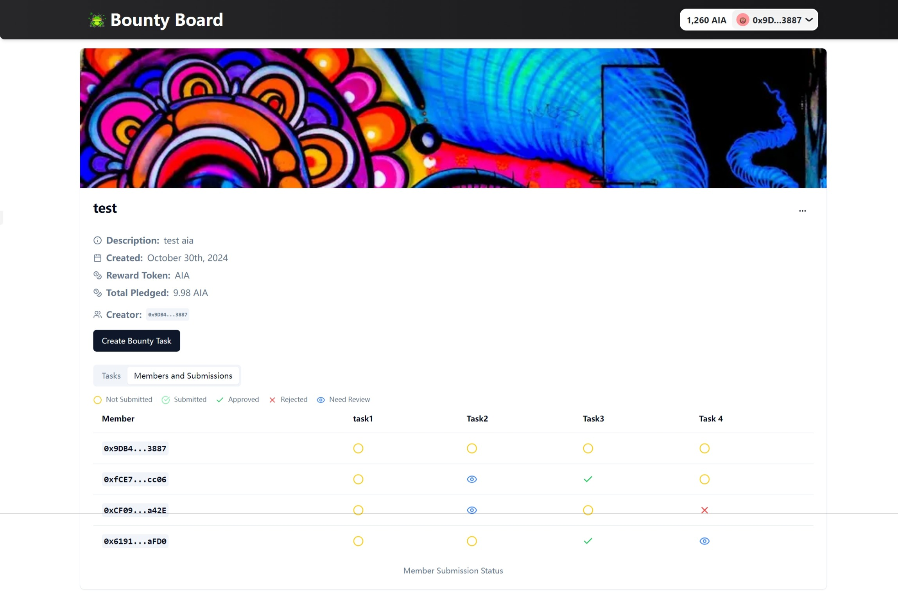

# Bounty Board: The Web3 Community Engagement Tool & Decentralized Organization Collaboration Platform

Bounty Board is a decentralized platform designed to streamline Web3 community activities and decentralized organization collaboration. It offers transparent, secure, and efficient solutions for tasks like airdrops and development missions, eliminating the hassle of user data recording, form creation, and token payments. All records are stored on-chain to ensure fairness and integrity in activities.

## Technical Architecture

Bounty Board employs the following technical architecture:

- **Smart Contracts (Solidity):** The core logic is implemented via smart contracts written in Solidity, managing functions such as bounty boards, activity tasks, submissions, reviews, and reward disbursements.
- **Next.js:** Next.js is utilized to build the frontend application, delivering a user-friendly interface and interaction experience.
- **Wagmi:** Wagmi is employed to connect Ethereum wallets, facilitating user interaction with smart contracts.
- **Shadcn/UI:** The Shadcn/UI component library is used to create an aesthetically pleasing user interface.

## Core Features

- **Simplified Activity Creation:** Communities can easily create various tasks, including study groups, project collaborations, airdrops, and more, with customizable task content, rewards, reviewers, and deadlines.
- **Automated Data Recording:** User information, participation status, and completion progress are automatically recorded, with automatic generation of comprehensive tables for visualization, eliminating the need for manual table maintenance.
- **On-Chain Token Payments:** Supports reward distribution using various tokens. Initiators must stake the corresponding tokens into the contract, which are automatically distributed upon review completion.
- **Permanent Data Storage:** All activity information and records are stored on the blockchain, ensuring permanent, tamper-proof preservation.

## Future Development Goals

- **Optimize Storage Structure:** Use IPFS to store complex records such as task descriptions, bounty board details, proof of submissions, images, etc., reducing on-chain storage costs and improving data storage efficiency.
- **Identity Storage and Binding:** Support user identity storage and binding for easier participation in multiple bounty board activities, enhancing the user experience.
- **Refined Permission Controls:** Implement more granular permission management, such as visibility control for different bounty boards or tasks, and require application verification for joining bounty boards.
- **Multi-Token Reward System:** Support issuing different types of tokens as rewards for various tasks, increasing the flexibility of activities.
- **Token Staking Revenue:** The platform can stake tokens from the contract into liquidity pools to generate revenue, creating a sustainable economic model.
- **Decentralized Organization Collaboration:** Expand platform functionality to serve as a tool for decentralized organizations for project collaboration, task distribution, and compensation management.
- **On-Chain AI Review:** Utilize on-chain AI Agents to review submitted tasks, enhancing review efficiency.
