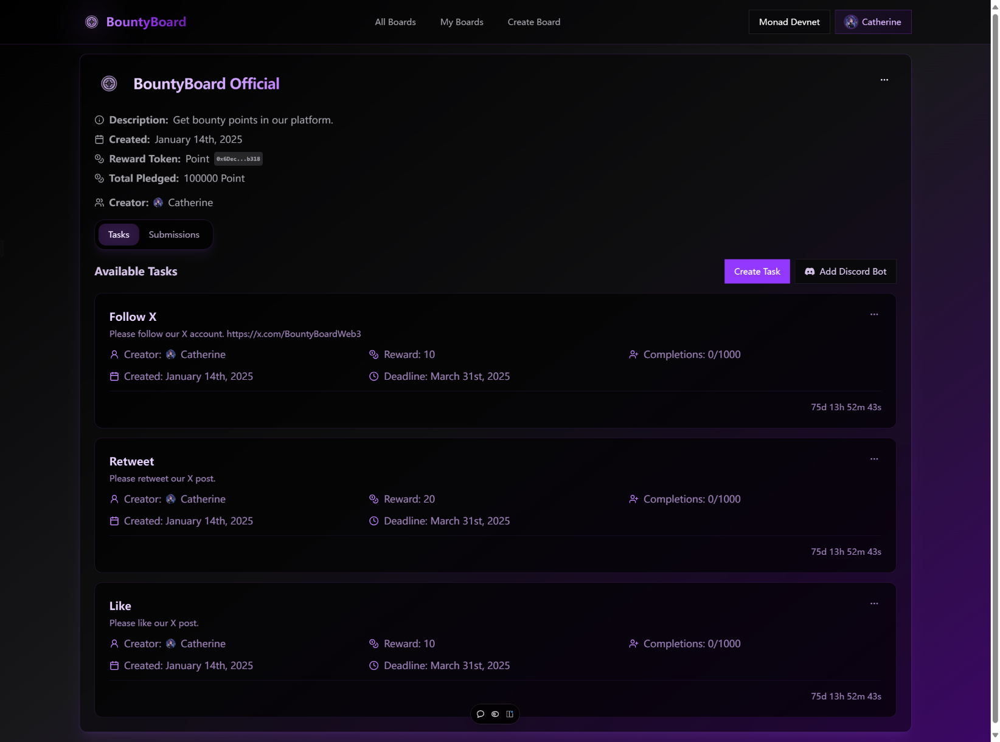

# BountyBoard


BountyBoard is a decentralized Web3 community engagement platform built on blockchain technology, aiming to automate task management and reward distribution, thereby increasing community participation and efficiency.

## Key Advantages:

* **Decentralization**: Utilizes blockchain technology to ensure transparency and trust in platform operations.
* **Smart Contracts**: Automates task management and reward distribution using smart contracts, improving efficiency and transparency.
* **AI-Agent (Eliza)**: Provides intelligent Q&A, task auditing, data analysis, and task notifications to enhance community interaction and efficiency.
* **User-Friendly Interface**: Offers a simple and intuitive interface for users to create and manage tasks, track progress, and monitor participation.

## Key Features

**Task Management**:

* **Multiple Task Types**: Supports various task types to cater to different community activities and engagement needs.
* **Customizable Completion Criteria**: Allows users to set specific conditions for task completion, ensuring tasks are tailored to individual project requirements.
* **Progress Tracking Dashboard**: Provides real-time monitoring of task progress and participant performance.

**Reward Distribution**:

* **Smart Contract Automation**: Automates reward distribution using smart contracts, ensuring transparency and fairness.
* **Multiple Token Support**: Supports various tokens for rewards, providing flexibility to cater to different community preferences.

**Community Management**:

* **AI-Agent (Eliza)**: Offers intelligent Q&A, task auditing, data analysis, and task notifications to enhance community interaction and efficiency.
* **Community Verification**: Enables community validation of AI-Agent operations, ensuring privacy and security.

## Start

### Install

First, install the dependencies:

```bash
pnpm install
```

Second, set the environment variables:

```bash
cp .env.example .env
```

### Run

```bash
pnpm dev
```

## Set up the agent

First, clone the agent repository:

```bash
git clone https://github.com/ai16z/eliza.git
```

Second, set the environment variables, you need to set the `DISCORD_APPLICATION_ID`, `DISCORD_API_TOKEN`,`BOUNTYBOARD_PRIVATE_KEY`(the private key of the account that will review the tasks), `BOUNTYBOARD_ADDRESS`, `GAIANET_MODEL`, `GAIANET_SERVER_URL`, `GAIANET_EMBEDDING_MODEL`, `USE_GAIANET_EMBEDDING`, `DSTACK_SIMULATOR_ENDPOINT`(the endpoint of the TEE simulator), `WALLET_SECRET_SALT`(the TEE secret salt) in the `.env` file.

```bash
cp .env.example .env
```

Third, install the dependencies:

```bash
pnpm install
```

Fourth, copy the `eliza-add` directory to the `eliza` directory:

Then, you can build and start the agent:

```bash
pnpm build
pnpm start --characters="characters/BountyBoard.character.json"
```

## Screenshot

**Home**


**Task**




[](https://dartnode.com "Powered by DartNode - Free VPS for Open Source")

